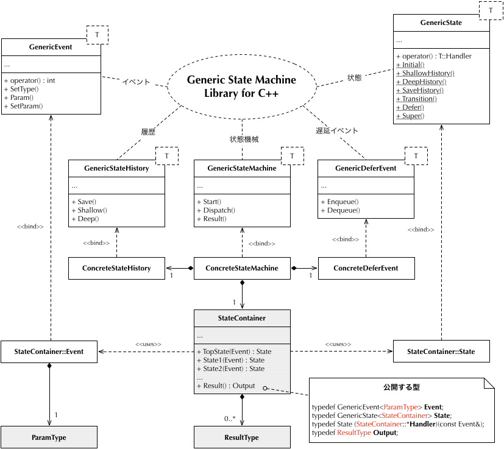

# Generic State Machine Library for C++

Generic State Machine Library for C++ は、汎用的な状態機械(オートマトン)ライブラリです。
継承/マクロ/キャストを使わずに、状態の入れ子構造や entry/exit アクション、初期遷移をサポートします。

## 参考

Generic State Machine Library for C++ の実装は Quantum Framework(以下、QF) のアイデアを元にしています。QF はその名の通り、状態機械を走らせるフレームワークで、 性能・拡張性・移植性・安全性・マルチスレッドといった点を充分に考慮した設計になっています。 サポートしている言語も C/C++/Java/C# などと幅広く、 組み込み系のリアルタイムシステムでも使えるのが大きな特徴です。

QF については 上記 URL の他、 Practical Statecharts in C/C++ でも詳しく解説されています。2002 年発行のため、最新版の QF の実装を調べる用途には向きませんが、 基本的な考え方を学ぶには良いテキストです。

この他の実装としては、テンプレートをふんだんに使った The Boost Statechart Library もあります。

## 構造

グレーの部分がユーザー定義クラスです。`StateContainer` のメンバー関数で「状態」を表現します。 上記の図では、`State1` や `State2` が状態関数になります。 状態関数は引数として `GenericEvent<ParamType>` を受け取り、`GenericState<StateContainer>` を返します。

`ConcreateStateMachine` は、状態関数に対して entry/exit アクションを呼び出したり、全体的な状態遷移を制御します。

最終更新日時: 2006/09/20 14:34:20

## ライブラリ
修正 BSD ライセンス

Copyright © 2006 Tomotaka SUWA All Rights Reserved.
